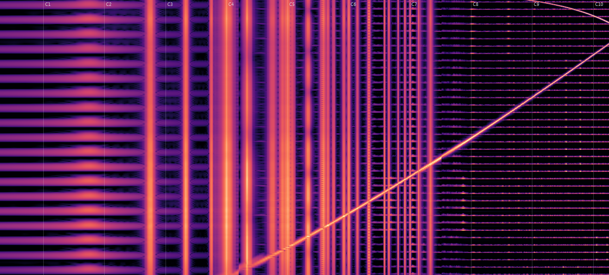
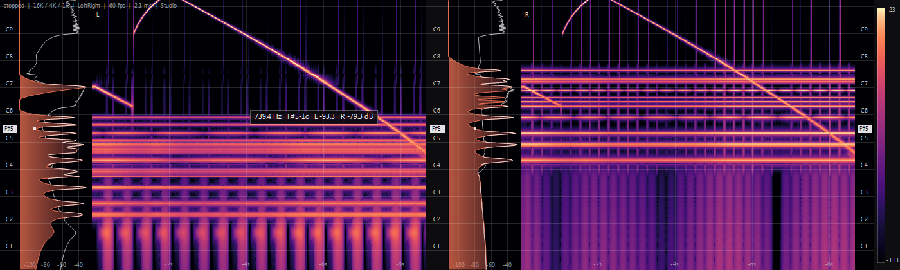
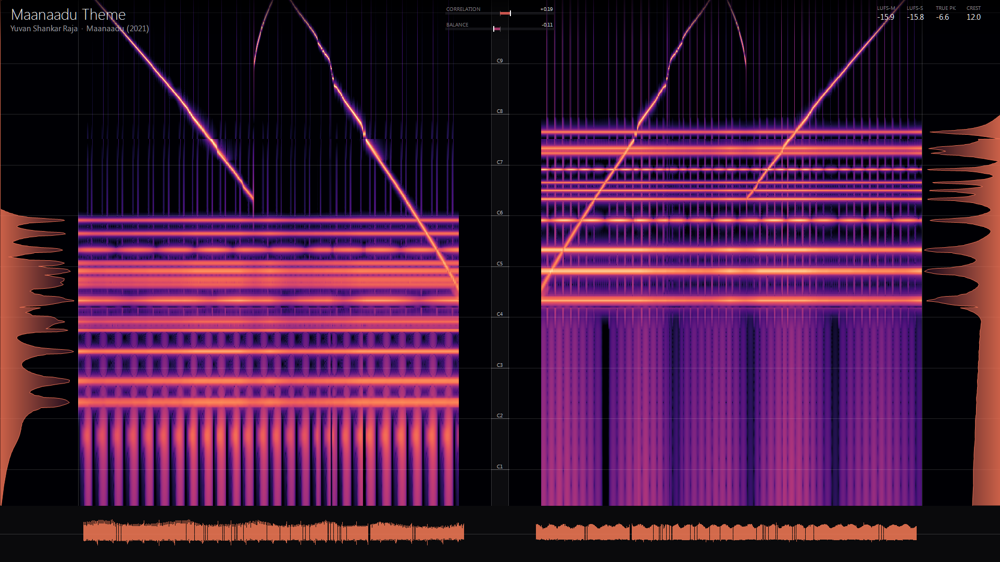
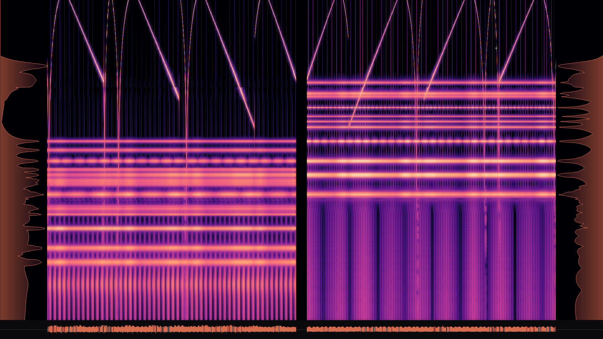

# Nostalgia+

A MusicBee panel plugin: multi-resolution spectrum analyser and scrolling spectrogram
with a musical frequency axis, perceptually uniform colour ramps, and adaptive dynamic
range.

Written as a rework of the *CoolEdit Nostalgia* visualiser. That plugin is more capable
than its defaults suggest, and several of its weaknesses are configuration rather than
code — see [Relationship to CoolEdit Nostalgia](#relationship-to-cooledit-nostalgia).
Nostalgia+ addresses the parts that are not reachable by settings.



*Studio preset: note-scale axis, magma ramp, +3 dB/oct tilt. Vertical lines are sustained
harmonics of an A/E/C chord, horizontal lines are kick and hat transients, the diagonal
is a 200 Hz → 9 kHz log sweep.*

## What it does differently

| | CoolEdit Nostalgia (as configured) | Nostalgia+ |
|---|---|---|
| Renderer | GDI, full-surface redraw | Ring-buffer bitmap, two blits/frame |
| Measured | 23 fps | 60 fps, 1.4–2.5 ms analysis |
| Audio source | `NowPlaying_GetSpectrumData` (MusicBee's fixed FFT) | WASAPI loopback, full-rate PCM |
| Transform | Single 2048-point FFT (21.5 Hz bins) | 16K/4K/1K stitched (2.9 Hz bins in the bass) |
| Frequency axis | Linear — ~75% of pixels on 5–21 kHz | Note / log / linear, note default |
| Colour | Non-uniform black→red ramp | Magma, Inferno, Viridis, Turbo, Ice, Grey, Nostalgia Red |
| Level mapping | Fixed dB window | Rolling-percentile auto-range, slew-limited |
| Readout | None | Hover: frequency, note name, cents, dB, time |
| Stereo | One channel at a time | Both channels everywhere - stacked lanes docked, mirrored fullscreen |

### Multi-resolution analysis

One FFT size is always a compromise: large enough to separate bass notes means smeared
transients up top. Nostalgia+ runs several sizes over the same instant and stitches them
with a log-domain crossfade, so bin density roughly tracks the log frequency axis.

| Profile | Sizes | Bass resolution @ 48 kHz |
|---|---|---|
| Fast | 4096 | 11.7 Hz |
| Balanced (default) | 16384 / 4096 / 1024 | 2.9 Hz — about one semitone at 50 Hz |
| High | 32768 / 8192 / 2048 / 512 | 1.5 Hz |

For comparison, a semitone at E1 (41 Hz) is 2.4 Hz wide. The original's 2048-point FFT
gives 21.5 Hz bins, so the entire bass register collapses into a smear.

### Spectral tilt

Music falls at roughly −3 dB/octave, so a flat display always looks empty up top. A
+3 dB/oct tilt (default in Studio) makes typical programme material render flat and
legible. Set it to zero for measurement work.

### Presets

- **Studio** — note axis, magma, +3 dB/oct, auto-range. Reading musical content.
- **Nostalgia** — Cool Edit red on a linear axis. The original look, without the
  saturated-red mapping.
- **QC** — viridis, linear, no tilt, fixed −110…0 dB, energy aggregation, High
  resolution. For spotting codec shelves and clipping.

## Building

No Visual Studio, SDK or NuGet packages needed — it compiles with the C# compiler that
ships with Windows.

```
build\build.cmd
```

Produces `bin\mb_NostalgiaPlus.dll` (~61 KB, AnyCPU, .NET Framework 4.0, zero
dependencies).

## Installing

1. Close MusicBee.
2. Copy `bin\mb_NostalgiaPlus.dll` into the MusicBee plugins folder. For the Microsoft
   Store build that is:
   `%LOCALAPPDATA%\Packages\50072StevenMayall.MusicBee_kcr266et74avj\LocalCache\Roaming\MusicBee\Plugins`
3. Start MusicBee, then add the panel via **View → Arrange Panels**, choosing
   *Nostalgia+*.

To remove it, delete the DLL. Settings live in `NostalgiaPlus\NostalgiaPlus.settings`
under MusicBee's persistent storage path, as plain `key=value` text.

## The docked panel

Two side-by-side per-channel panes, each a spectrum graph beside its own spectrogram
sharing a vertical frequency axis, with a note gutter between them. Frequency labels
repeat at both outer edges so a value can be read without tracking across the panel.



The docked panel and the fullscreen view render through the same `StereoScope` and
`ChannelPane`, so the two modes are the same code and cannot drift apart. They differ
only in their chrome: the panel adds a colour bar and status line, fullscreen adds
meters, waveform lanes and the quick-button row.

Hovering draws a line at that frequency across **both** panes and reads out every
channel at once - `976.7 Hz  B5 -20c  L -52.0  R -45.9 dB` - with the note stamped onto
the frequency axes. The panes share one axis, so the same vertical position is the same
frequency in both.

## Using it

- **Right-click** either view for presets, palette, frequency scale, resolution,
  spectral tilt, scroll speed and display toggles. Both share one menu builder
  (`src/Ui/MenuFactory.cs`) so they cannot drift apart.
- **Space** or **double-click** freezes the display.
- **Hover** for frequency, nearest note ± cents, level, and time offset.

## Fullscreen mirrored stereo view

Press **F11** in the panel (or right-click to Fullscreen stereo view). It opens borderless
on whichever monitor MusicBee is on; **Esc** or **F11** leaves.



Frequency runs vertically with low notes at the bottom; time runs horizontally. Layout,
outside in: a spectrum curve pinned to each screen edge, then that channel's spectrogram,
then a narrow gutter carrying the note labels where the two meet.

New columns enter at the outer edges beside the curves and age toward the centre, so each
channel's newest slice sits against its own curve - a peak in the curve lines up with the
bright column that produced it - and the oldest data of both channels meets in the middle.
Curve baselines are pinned to the screen edges and grow inward.

At 1920x1080 that gives about 108 px per octave - roughly 9 px per semitone, enough for
semitone gridlines to stay legible - and around 14 seconds of history per side.

A time-aligned waveform lane runs along the bottom, mirrored the same way and sharing
the spectrograms' time axis. The gap the two lanes leave in the middle is the **centre
deck**, and everything that describes the pair of channels rather than one of them lives
there.

It is in three parts. The **goniometer sits on the middle of the deck** - the middle of
the screen, and the axis the whole display is mirrored about - and the two halves it
leaves are equal by construction.

**Left: what is playing.** Artwork, then title, composer, artists, album and year. How
many lines they get follows the deck height - four named lines at 150px, two joined
pairs at 120, the title alone below that. Composer appears only if MusicBee reports a
field by that name; the tag id is looked up at startup rather than assumed.

**Right: what the sound is doing.** The transport, seek bar and clock share one row, and
that bar sits in the same column as the correlation and balance bars below it so the
three line up. Beside them, nine readouts, each with its own switch under
*View - Centre deck contents*:

| | |
|---|---|
| `LUFS-M` / `LUFS-S` | momentary and short-term loudness |
| `LUFS-I` | gated integrated loudness since the track changed |
| `LRA` | loudness range in LU - how much the track moves |
| `TRUE PK` | true peak, red above -1 dBTP |
| `CREST` | peak minus RMS |
| `OVERS` | true-peak excursions past -1 dBTP, with the time of the last |
| `BPM` | tempo, by autocorrelation over the onsets |
| `BRIGHT` | spectral centre of gravity, in hertz |

The last three restart with each track. Overs counts excursions no closer than 200ms
apart, so a master that simply sits on the ceiling reads five a second rather than five
thousand.

The deck holds what fits and sheds the rest, readout columns first and from the right.
At a 45% graph on a 1920-wide screen there is room for six of the nine. **Centre deck
height** (92 / 120 / 150 / 190px) trades image for deck: past 120px the readout grid
gains a third row, which turns nine readouts into three columns instead of five.

Nothing is painted over the image. The title and the meters used to float in the top
corners on a gradient bar, which covered the top of both spectrograms and pushed the
repeated frequency labels 84 px down the axis to stay out from under it.

The deck only gets the gap between the two graph strips, so it holds as much as fits and
drops the rest - artwork first, then the loudness columns, then the title, and the
transport block last. The goniometer always stays. Widen the graph strips
(*View - Graph size*) to make room.

**Double-click a spectrogram column to seek there.** The image is a timeline with far
more detail than a seek bar - you can aim at a single hit. Freezing first is fine: the
position the jump is measured back from is stamped when the image stops, not when you
click.

**Press `A` to hold the current average spectrum as an amber reference** and leave it
there while the music moves under it - take it on one track, start the next, and compare
tonal balance directly rather than from memory. `A` again drops it.

Right-click anywhere for the full menu - the same one the docked panel uses, plus the
fullscreen toggles and a curve-width setting.

The same keys work in both views, and every setting is shared - whatever you set up
docked is what you get on `F11`, and back again.

| Key | Action |
|---|---|
| `Esc` / `F11` | Exit |
| `I` | Immersive mode |
| `Space` | Freeze |
| `A` | Hold / drop the comparison curve |
| `W` | Waveform lane |
| `O` | Centre deck |
| `G` | Grid |
| `P` | Cycle palette |

### Immersive mode

Press **`I`** (or right-click to Immersive mode). Built for watching music rather than
measuring it, on the same mirrored arrangement.



- **Glow.** Bright content blooms. It is built from an offscreen composite rather than
  the ring bitmap directly: the ring stores columns rotated by a head index, so blurring
  it would bleed the newest column into the oldest. A colour matrix isolates bright
  material and converts luminance into alpha, so the halo adds light without darkening
  the blacks. `Glow` is a menu toggle if it costs too much - the hint line reports paint
  time alongside fps.
- **Furniture fades.** After 3 s idle, labels, meters, gridlines and the gutter fade over
  1.5 s and the cursor hides; any input brings them back. A track change shows the title
  for 6 s even while faded.
- **It applies analysis settings that suit music** - note axis, +3 dB/oct tilt, Balanced
  resolution, slower scroll, slimmer waveform ribbon.

That last point matters more than the styling. A linear axis puts everything below 1 kHz
into 4.5% of the vertical space, and `Fast` resolution gives 11.7 Hz bins where a semitone
at A2 is 6.5 Hz wide - dense music then renders as an undifferentiated wall no amount of
glow can rescue. Entering immersive mode therefore applies the Immersive preset rather
than only changing how things are drawn.

**Known limitation:** on highly correlated material (commercial masters often measure
+0.8 or higher) the two mirrored halves are near-identical images, so half the screen
restates the other half. That is inherent to the mirrored arrangement. Encoding pan as
colour in a single full-width view is the change that would fix it.

### Stereo costs one FFT, not two

Both channels are real-valued, so the left is packed into the real part of a single
complex transform and the right into the imaginary part. A real signal has a Hermitian
spectrum, so afterwards:

```
X[k] = (Z[k] + conj(Z[N-k])) / 2      (left)
Y[k] = (Z[k] - conj(Z[N-k])) / 2j     (right)
```

Dual-channel therefore costs what mono costs, which is what keeps High resolution inside
the frame budget fullscreen. Measured crosstalk is at the numeric floor.

### Loudness

ITU-R BS.1770-4 K-weighting: a high shelf and a ~38 Hz high-pass per channel, then mean
square over 400 ms (momentary) and 3 s (short-term). True peak uses 4x polyphase
oversampling, which catches inter-sample peaks a sample-peak reading misses - the usual
reason a "0 dBFS" master still clips a converter. The published 48 kHz coefficients are
used directly; deriving them lands about 0.2 dB off, and shared-mode WASAPI is almost
always 48 kHz.

## Architecture

```
src/
  MusicBeeInterface.cs     API binding, extracted by reflection from the installed host
  Plugin.cs                MusicBee entry points, panel creation, settings lifecycle
  Settings.cs              key=value persistence, presets
  Audio/
    Wasapi.cs              Core Audio COM interop
    LoopbackCapture.cs     shared-mode loopback capture thread
  Dsp/
    Fft.cs                 radix-2 FFT, window functions, paired real transform
    Loudness.cs            BS.1770 K-weighting, gated LUFS and LRA, true peak
    SampleRing.cs          lock-guarded ring of recent stereo samples
    FrequencyMap.cs        column to frequency band edges, note naming
    SpectrumAnalyzer.cs    multi-resolution analysis and band stitching
    DynamicRange.cs        rolling-percentile floor/ceiling tracking
  Render/
    Palette.cs             colour ramps as 256-entry ARGB LUTs
    SpectrogramBuffer.cs   circular bitmap, O(width) per frame
    ColumnSpectrogram.cs   vertical-frequency variant plus the waveform ring
  Ui/
    AnalyzerPanel.cs       docked stereo panel: curve pane plus two spectrogram lanes
    BottomBand.cs          waveform lanes, centre deck and metering, shared by both views
    Immersion.cs           backdrop, hue drift, beat flare, idle fade - shared
    FullscreenView.cs      mirrored stereo view, waveform lanes, backdrop
    CenterDeck.cs          metadata, centred goniometer, transport, readouts
    MenuFactory.cs         the right-click menu shared by both views
```

Analysis runs on its own thread and hands finished rows to the UI thread, so a slow
frame never stalls MusicBee's interface.

### The namespace is load-bearing

MusicBee discovers plugins with `assembly.GetType("MusicBeePlugin.Plugin")`. The entry
point class must sit in that exact namespace or the host silently ignores the DLL - it
does not appear in the plugin list and no error is reported. Everything else lives under
`NostalgiaPlus.*`; only `Plugin` and the API binding are in `MusicBeePlugin`.

`build/Verify.cs` reproduces the host's discovery and full call sequence - type lookup,
`Initialise` against a zeroed API block to exercise struct marshaling, panel creation,
paint, and shutdown. Run it after any change to the interface or entry points:

```
csc -r:System.Drawing.dll -r:System.Windows.Forms.dll build\Verify.cs
Verify.exe bin\mb_NostalgiaPlus.dll
```

### Why the spectrogram is a ring

Scrolling by shifting every pixel costs a full-surface copy per frame, which is what
holds the original near 23 fps at this window size. Here the bitmap is circular: each
frame writes exactly one row and moves a head index, and painting is two blits whatever
the panel's height. Cost per frame is O(width), not O(width × height).

## Verification

`build/TestHarness.cs` checks the DSP against synthetic signals — compile it against the
built DLL and run. Current results:

```
100 Hz tone       found  99.4 Hz   -12.14 dB  (expected -12.04)
1 kHz tone        found 993.8 Hz    -6.65 dB  (expected  -6.02)
crossover @300Hz  -51.9 vs -55.1 dB on white noise (no visible step)
crossover @3kHz   -43.7 vs -47.0 dB
note readout      440→A4 +0.0c, 261.6→C4 +0.0c, 41.2→E1 +0.0c, 444→A4 +15.7c
ALL CHECKS PASSED
```

Level error is window scalloping loss, bounded at 1.42 dB for Hann.

## Known limits

- **Loopback captures the system mix**, so other applications' audio appears too. If the
  output device is held in exclusive mode, capture reports it and the panel stays dark.
- **No whole-track view yet.** The live window cannot show a codec shelf across a whole
  file the way an offline render can. This is the main planned addition.
- Loudness metering appears in the fullscreen view only, not the docked panel.
- `ChannelMode` (Mid/Left/Right/Side) is now unused: both views show both channels.
- `build/FsHarness.cs` drives the fullscreen view offscreen with synthetic stereo, so the
  layout can be checked without taking over a display.

## Relationship to CoolEdit Nostalgia

Nostalgia+ is an independent implementation, not derived from that plugin's code. The
MusicBee API struct layout was recovered by reflecting over the installed assembly so it
matches the host exactly.

If you would rather keep using the original, most of its weaknesses in a default setup
are reachable from its own settings — switch `Renderer` to Direct2D, `LinearScale` to
`NoteScale`, `SamplesSource` off `MusicBeeFFT`, and the FFT size to 8K.
